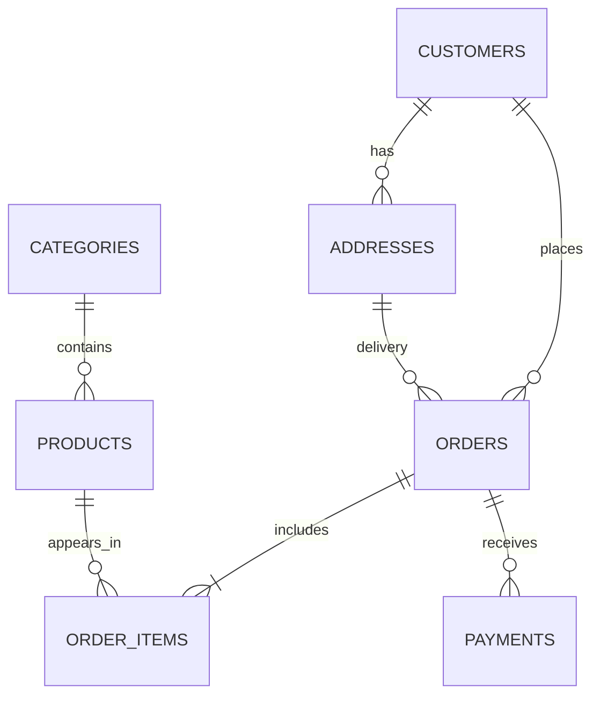

# Практикум із баз даних: інтернет-магазин

Методичні рекомендації до практичних занять для студентів 3-го курсу

## 1. Про практикум

Практикум доповнює лекційний курс «Бази даних» наскрізним прикладом бази даних інтернет-магазину: від аналізу предметної області та побудови концептуальної моделі до вкладених SQL-запитів і документування проєкту.

- СУБД: **MySQL 8.4 LTS** (приклади також сумісні з актуальними випусками MySQL 8.0).
- Клієнт бази даних: **DBeaver Community Edition**.
- Формат звіту: Markdown.

### Результати навчання

Після виконання робіт студент умітиме:

- виділяти сутності, атрибути, зв’язки та бізнес-правила;
- будувати ER-модель і перетворювати її на реляційну схему;
- обґрунтовувати ключі та обмеження цілісності;
- перевіряти схему на відповідність 1НФ, 2НФ і 3НФ;
- створювати некорельовані, корельовані та багаторівневі запити;
- використовувати `IN`, `EXISTS`, `NOT EXISTS`, скалярні підзапити та CTE;
- створювати документацію, достатню для розгортання та супроводу БД.

| № | Тема | Результат |
|---:|---|---|
| 1 | Розробка концептуальної структури БД | ER-модель, реляційна схема, DDL |
| 2 | Створення вкладених запитів | Набір перевірених SQL-запитів |
| 3 | Документування проєкту БД | Технічна документація та звіт |

## 2. Підготовка робочого середовища

> Команди встановлення можуть відрізнятися залежно від версії ОС. Для навчальної аудиторії викладач має заздалегідь перевірити їх на цільових комп’ютерах.

### 2.1. Windows

1. Завантажте MSI-пакет **MySQL Community Server 8.4 LTS** зі [сторінки завантажень MySQL](https://dev.mysql.com/downloads/mysql/).
2. Запустіть інсталятор, а після нього — MySQL Configurator.
3. Налаштуйте MySQL Server і залиште порт `3306`, якщо він вільний.
4. Оберіть автентифікацію із сильним шифруванням паролів.
5. Задайте пароль користувача `root` і збережіть його в менеджері паролів.
6. Налаштуйте MySQL як службу Windows з автоматичним запуском.
7. Завершіть конфігурацію і перевірте, що служба MySQL працює.

Для перевірки у PowerShell або Command Prompt:

```powershell
mysql --version
mysql -u root -p
```

Якщо команда `mysql` не знайдена, додайте каталог `bin` інсталяції MySQL до системної змінної `PATH` або виконайте команду за повним шляхом.

### 2.2. Ubuntu / Debian Linux

```bash
sudo apt update
sudo apt install mysql-server
sudo systemctl enable --now mysql
sudo systemctl status mysql
```

За потреби виконайте базове посилення конфігурації:

```bash
sudo mysql_secure_installation
```

Перевірка локального входу залежить від налаштованого способу автентифікації:

```bash
sudo mysql
```

або:

```bash
mysql -u root -p
```

Пакет із системного репозиторію може відставати від поточного LTS-випуску. Якщо в усіх студентів має бути саме MySQL 8.4, спочатку підключіть офіційний MySQL APT Repository. Деталі наведено в [інструкції MySQL для Linux](https://dev.mysql.com/doc/refman/8.4/en/linux-installation.html) та [інструкції для APT](https://dev.mysql.com/doc/refman/8.4/en/linux-installation-apt-repo.html).

Для Fedora/RHEL-подібних систем назви пакета та служби можуть відрізнятися; використовуйте офіційний MySQL Yum Repository для вашого випуску ОС.

### 2.3. macOS

Варіант A — офіційний DMG-пакет:

1. Завантажте MySQL Community Server зі [сторінки завантажень MySQL](https://dev.mysql.com/downloads/mysql/) для своєї архітектури (`ARM64` для Apple Silicon або `x86_64` для Intel).
2. Установіть пакет, задайте пароль `root`.
3. Запустіть сервер у системних налаштуваннях MySQL.

Варіант B — Homebrew:

```bash
brew install mysql
brew services start mysql
mysql --version
mysql_secure_installation
```

### 2.4. Встановлення DBeaver Community Edition

1. Завантажте [DBeaver Community](https://dbeaver.io/download/) з офіційного сайту для своєї ОС.
2. Установіть і запустіть програму.
3. Оберіть **Database → New Database Connection → MySQL**.
4. Заповніть параметри:

| Параметр | Типове значення |
|---|---|
| Host | `localhost` |
| Port | `3306` |
| Database | поки можна залишити порожнім |
| Username | `root` або навчальний користувач |
| Password | пароль, заданий під час встановлення |

5. Натисніть **Test Connection**. Під час першого підключення DBeaver запропонує завантажити JDBC-драйвер MySQL — погодьтеся. Детальні параметри описано в [офіційній інструкції підключення MySQL](https://dbeaver.com/docs/dbeaver/Database-driver-MySQL/).
6. Після успішного тесту натисніть **Finish**.

У реальному проєкті не слід працювати як `root`. Для практикуму створіть окрему базу й користувача в SQL Editor DBeaver:

```sql
CREATE DATABASE online_store
    CHARACTER SET utf8mb4
    COLLATE utf8mb4_0900_ai_ci;

CREATE USER 'store_student'@'localhost'
    IDENTIFIED BY 'ChangeThisTrainingPassword!';

GRANT ALL PRIVILEGES ON online_store.*
    TO 'store_student'@'localhost';
```

Пароль у прикладі потрібно замінити. Не додавайте справжні паролі до Git. Створіть у DBeaver нове підключення користувача `store_student`, виберіть базу `online_store` і перевірте:

```sql
SELECT VERSION() AS mysql_version,
       CURRENT_USER() AS authenticated_user,
       DATABASE() AS current_database;
```

Для виконання скрипта в DBeaver відкрийте **SQL Editor → New SQL Script**. `Ctrl+Enter` (`Cmd+Enter` у macOS) виконує поточний оператор, а **Execute SQL Script** — увесь файл. Переконайтеся, що активним є правильне підключення та схема.

## 3. Предметна область

Інтернет-магазин зберігає каталог товарів, клієнтів, адреси доставки, замовлення, позиції замовлень і платежі.

Основні бізнес-правила:

1. Товар належить одній категорії, категорія містить багато товарів.
2. Клієнт може мати декілька адрес і замовлень.
3. Замовлення має адресу доставки та одну або більше позицій.
4. Товар може входити до багатьох замовлень.
5. Ціна в позиції фіксується на момент купівлі.
6. Email клієнта й артикул товару (SKU) унікальні.
7. Кількість товару і грошові суми мають бути додатними.
8. Видалення клієнта із замовленнями та категорії з товарами заборонене.



---

# Тема 1. Концептуальна структура бази даних

**Мета:** перетворити текстові вимоги на ER-модель, нормалізовану реляційну схему та фізичну реалізацію в MySQL.

## Хід роботи

### Етап 1. Аналіз вимог

Спочатку випишіть кандидатів на сутності та їх атрибути. Потім проаналізуйте такі бізнес-правила й визначте, які сутності, зв’язки та обмеження потрібні для їх реалізації.

| Код | Бізнес-правило | Реалізація |
|---|---|---|
| BR-01 | Кожен клієнт має унікальну адресу електронної пошти. Email є обов’язковим і не може бути порожнім рядком. | `NOT NULL`, `UNIQUE`, `CHECK (TRIM(email) <> '')`; регістронезалежне порівняння забезпечує collation стовпця |
| BR-02 | Кожен товар належить рівно одній наявній категорії. Категорія може не містити товарів або містити багато товарів. | `products.category_id NOT NULL` і зовнішній ключ на `categories.category_id` |
| BR-03 | SKU однозначно ідентифікує товар у каталозі та не може повторюватися. | `products.sku NOT NULL UNIQUE` |
| BR-04 | Поточна ціна товару має бути більшою за нуль, а складський залишок — цілим невід’ємним числом. | `DECIMAL(12,2)`, `CHECK (price > 0)`, `INT UNSIGNED` |
| BR-05 | Кожна адреса належить рівно одному клієнту. Клієнт може мати нуль, одну або декілька адрес. | зовнішній ключ `addresses.customer_id`; зв’язок «один до багатьох» |
| BR-06 | Кожне замовлення належить рівно одному клієнту та використовує одну з адрес цього самого клієнта. | зовнішні ключі з `orders`; належність адреси клієнту потребує складеного зовнішнього ключа, тригера або перевірки прикладною логікою |
| BR-07 | Замовлення повинно містити щонайменше одну позицію; той самий товар не може двічі повторюватися в одному замовленні. | наявність позиції забезпечує транзакція або прикладна логіка; `PRIMARY KEY (order_id, product_id)` забороняє повторення |
| BR-08 | Кількість товару в позиції є цілим числом понад нуль. Ціна продажу також більша за нуль і фіксується на момент оформлення незалежно від подальшої зміни каталожної ціни. | `CHECK (quantity > 0)`, `CHECK (unit_price > 0)`; історична ціна зберігається в `order_items.unit_price` |
| BR-09 | Замовлення може мати лише статус `new`, `paid`, `shipped`, `completed` або `cancelled`; платіж — `pending`, `successful`, `failed` або `refunded`. | обмеження `CHECK ... IN (...)` або окремі таблиці-довідники |
| BR-10 | Не можна видалити клієнта, який має замовлення, категорію з товарами або товар, що фігурує в історії замовлень. Позиції видаленого замовлення видаляються разом із ним. | зовнішні ключі з `ON DELETE RESTRICT` для історичних даних і `ON DELETE CASCADE` для `order_items` |

Зверніть увагу, що не кожне бізнес-правило можна надійно реалізувати одним декларативним обмеженням. Наприклад, зовнішній ключ гарантує існування адреси, але звичайний зовнішній ключ `orders.shipping_address_id` не перевіряє, що ця адреса належить клієнту з `orders.customer_id`. Такі випадки потрібно явно документувати.

### Етап 2. Нормалізація

Нормалізація — це послідовне перетворення структури даних для усунення надлишкового дублювання та аномалій вставлення, оновлення й видалення. Розглянемо шлях від ненормалізованих даних до 3НФ.

#### Початкова ненормалізована форма

Уявімо, що замовлення зберігають в одній таблиці, а всі товари — списками в окремих комірках:

| order_id | order_date | customer_id | customer_name | customer_email | city | product_ids | product_names | quantities | unit_prices |
|---:|---|---:|---|---|---|---|---|---|---|
| 1001 | 2026-02-10 | 1 | Анна Коваль | anna@example.com | Київ | 11, 15 | Ноутбук Pro 14, Миша | 1, 2 | 44999, 1199 |
| 1002 | 2026-02-12 | 2 | Богдан Мельник | bohdan@example.com | Львів | 13, 16 | Смартфон X, USB-C адаптер | 1, 1 | 21999, 899 |

Така таблиця не відповідає 1НФ: `product_ids`, `product_names`, `quantities` і `unit_prices` містять множини значень. Неможливо надійно встановити зв’язок між елементами списків, задати зовнішній ключ на окремий товар або знайти товари звичайною умовою рівності.

#### Перша нормальна форма — 1НФ

Зробимо всі значення атомарними: один рядок представляє один товар у замовленні. Кандидатом на ключ стає пара `(order_id, product_id)`.

| order_id | order_date | customer_id | customer_name | customer_email | city | product_id | product_name | category_id | category_name | quantity | unit_price |
|---:|---|---:|---|---|---|---:|---|---:|---|---:|---:|
| 1001 | 2026-02-10 | 1 | Анна Коваль | anna@example.com | Київ | 11 | Ноутбук Pro 14 | 1 | Ноутбуки | 1 | 44999 |
| 1001 | 2026-02-10 | 1 | Анна Коваль | anna@example.com | Київ | 15 | Бездротова миша | 3 | Аксесуари | 2 | 1199 |
| 1002 | 2026-02-12 | 2 | Богдан Мельник | bohdan@example.com | Львів | 13 | Смартфон X | 2 | Смартфони | 1 | 21999 |
| 1002 | 2026-02-12 | 2 | Богдан Мельник | bohdan@example.com | Львів | 16 | USB-C адаптер | 3 | Аксесуари | 1 | 899 |

Таблиця відповідає 1НФ, але не 2НФ. За складеного ключа `(order_id, product_id)` частина атрибутів залежить лише від `order_id`, а інша — лише від `product_id`:

```text
order_id   → order_date, customer_id, customer_name, customer_email, city
product_id → product_name, category_id, category_name
(order_id, product_id) → quantity, unit_price
```

Наслідки:

- зміна email клієнта потребує оновлення багатьох рядків;
- товар не можна додати до каталогу, доки його не замовили;
- видалення останньої позиції товару може видалити єдині відомості про нього.

#### Друга нормальна форма — 2НФ

Винесемо атрибути, що залежать лише від частини складеного ключа, в окремі таблиці.

**orders_2nf**

| order_id | order_date | customer_id | customer_name | customer_email | city |
|---:|---|---:|---|---|---|
| 1001 | 2026-02-10 | 1 | Анна Коваль | anna@example.com | Київ |
| 1002 | 2026-02-12 | 2 | Богдан Мельник | bohdan@example.com | Львів |

**products_2nf**

| product_id | product_name | category_id | category_name |
|---:|---|---:|---|
| 11 | Ноутбук Pro 14 | 1 | Ноутбуки |
| 13 | Смартфон X | 2 | Смартфони |
| 15 | Бездротова миша | 3 | Аксесуари |
| 16 | USB-C адаптер | 3 | Аксесуари |

**order_items_2nf**

| order_id | product_id | quantity | unit_price |
|---:|---:|---:|---:|
| 1001 | 11 | 1 | 44999 |
| 1001 | 15 | 2 | 1199 |
| 1002 | 13 | 1 | 21999 |
| 1002 | 16 | 1 | 899 |

Тепер неключові атрибути залежать від повного ключа кожної таблиці. Проте схема ще не відповідає 3НФ через транзитивні залежності:

```text
order_id → customer_id → customer_name, customer_email
customer_id → city
product_id → category_id → category_name
```

Якщо один клієнт створить десять замовлень, його ім’я та email повторяться десять разів. Якщо категорія має сто товарів, її назва повториться сто разів.

#### Третя нормальна форма — 3НФ

Винесемо дані клієнтів, адрес і категорій у самостійні відношення:

```text
CUSTOMERS(customer_id PK, full_name, email UK)
ADDRESSES(address_id PK, customer_id FK, city, street, postal_code)
CATEGORIES(category_id PK, name UK)
PRODUCTS(product_id PK, category_id FK, sku UK, name, price, stock_quantity)
ORDERS(order_id PK, customer_id FK, shipping_address_id FK, status, created_at)
ORDER_ITEMS(order_id PK/FK, product_id PK/FK, quantity, unit_price)
PAYMENTS(payment_id PK, order_id FK, amount, status, paid_at)
```

У 3НФ кожен неключовий атрибут описує ключ, увесь ключ і нічого, крім ключа. `unit_price` в `order_items` не є випадковим дублюванням поточної `products.price`: це історична ціна конкретного продажу, яка функціонально залежить від позиції замовлення.

Перевірте, які аномалії зникли після кожного перетворення. Окремо поясніть, чому обчислювану суму позиції `quantity * unit_price` не обов’язково зберігати як ще один атрибут.

### Етап 3. Побудова ER-моделі

Побудуйте ER-діаграму отриманої після нормалізації схеми в одному з вебсервісів:

- [dbdiagram.io](https://dbdiagram.io/) — спеціалізований ERD-редактор на основі текстової мови DBML; базові можливості доступні безкоштовно;
- [DrawSQL](https://drawsql.app/draw) — візуальний редактор схем, який дозволяє почати діаграму без реєстрації;
- [diagrams.net](https://app.diagrams.net/) — універсальний безкоштовний редактор із бібліотекою фігур Entity Relation.

Не передавайте вебсервісам паролі, реальні персональні дані або дамп робочої бази. Для цього завдання достатньо назв навчальних таблиць, полів і зв’язків.

Для кожної сутності вкажіть:

- первинний ключ;
- атрибути й обов’язковість їх значень;
- зовнішні та альтернативні ключі;
- кардинальність і обов’язковість зв’язків.

Поясніть:

- чому `orders` і `products` утворюють зв’язок багато-до-багатьох;
- навіщо `order_items` зберігає `unit_price`;
- чому адреса винесена в окрему таблицю;
- що станеться з історією після зміни поточної ціни товару.

Після створення таблиць на наступному етапі відкрийте їх у DBeaver через **Database Navigator → View Diagram**. DBeaver побудує діаграму за фактично створеними таблицями та зовнішніми ключами. Порівняйте її з проєктною ER-моделлю: це перевірка реалізації, а не побудова моделі з нуля.

### Етап 4. Створення схеми

```sql
USE online_store;

CREATE TABLE categories (
    category_id BIGINT UNSIGNED AUTO_INCREMENT PRIMARY KEY,
    name VARCHAR(100) NOT NULL UNIQUE
) ENGINE = InnoDB;

CREATE TABLE customers (
    customer_id BIGINT UNSIGNED AUTO_INCREMENT PRIMARY KEY,
    full_name VARCHAR(150) NOT NULL,
    email VARCHAR(254) NOT NULL UNIQUE,
    created_at TIMESTAMP NOT NULL DEFAULT CURRENT_TIMESTAMP,
    CONSTRAINT chk_customers_email_not_blank CHECK (TRIM(email) <> '')
) ENGINE = InnoDB;

CREATE TABLE addresses (
    address_id BIGINT UNSIGNED AUTO_INCREMENT PRIMARY KEY,
    customer_id BIGINT UNSIGNED NOT NULL,
    city VARCHAR(100) NOT NULL,
    street VARCHAR(200) NOT NULL,
    postal_code VARCHAR(20) NOT NULL,
    CONSTRAINT fk_addresses_customer FOREIGN KEY (customer_id)
        REFERENCES customers(customer_id) ON DELETE CASCADE
) ENGINE = InnoDB;

CREATE TABLE products (
    product_id BIGINT UNSIGNED AUTO_INCREMENT PRIMARY KEY,
    category_id BIGINT UNSIGNED NOT NULL,
    sku VARCHAR(40) NOT NULL UNIQUE,
    name VARCHAR(200) NOT NULL,
    price DECIMAL(12, 2) NOT NULL,
    stock_quantity INT UNSIGNED NOT NULL DEFAULT 0,
    is_active BOOLEAN NOT NULL DEFAULT TRUE,
    CONSTRAINT chk_products_price CHECK (price > 0),
    CONSTRAINT fk_products_category FOREIGN KEY (category_id)
        REFERENCES categories(category_id) ON DELETE RESTRICT,
    INDEX idx_products_category (category_id)
) ENGINE = InnoDB;

CREATE TABLE orders (
    order_id BIGINT UNSIGNED AUTO_INCREMENT PRIMARY KEY,
    customer_id BIGINT UNSIGNED NOT NULL,
    shipping_address_id BIGINT UNSIGNED NOT NULL,
    status VARCHAR(20) NOT NULL DEFAULT 'new',
    created_at TIMESTAMP NOT NULL DEFAULT CURRENT_TIMESTAMP,
    CONSTRAINT chk_orders_status
        CHECK (status IN ('new', 'paid', 'shipped', 'completed', 'cancelled')),
    CONSTRAINT fk_orders_customer FOREIGN KEY (customer_id)
        REFERENCES customers(customer_id) ON DELETE RESTRICT,
    CONSTRAINT fk_orders_address FOREIGN KEY (shipping_address_id)
        REFERENCES addresses(address_id) ON DELETE RESTRICT,
    INDEX idx_orders_customer (customer_id),
    INDEX idx_orders_created_at (created_at)
) ENGINE = InnoDB;

CREATE TABLE order_items (
    order_id BIGINT UNSIGNED NOT NULL,
    product_id BIGINT UNSIGNED NOT NULL,
    quantity INT UNSIGNED NOT NULL,
    unit_price DECIMAL(12, 2) NOT NULL,
    PRIMARY KEY (order_id, product_id),
    CONSTRAINT chk_order_items_quantity CHECK (quantity > 0),
    CONSTRAINT chk_order_items_price CHECK (unit_price > 0),
    CONSTRAINT fk_items_order FOREIGN KEY (order_id)
        REFERENCES orders(order_id) ON DELETE CASCADE,
    CONSTRAINT fk_items_product FOREIGN KEY (product_id)
        REFERENCES products(product_id) ON DELETE RESTRICT,
    INDEX idx_items_product (product_id)
) ENGINE = InnoDB;

CREATE TABLE payments (
    payment_id BIGINT UNSIGNED AUTO_INCREMENT PRIMARY KEY,
    order_id BIGINT UNSIGNED NOT NULL,
    amount DECIMAL(12, 2) NOT NULL,
    status VARCHAR(20) NOT NULL,
    paid_at TIMESTAMP NULL,
    CONSTRAINT chk_payments_amount CHECK (amount > 0),
    CONSTRAINT chk_payments_status
        CHECK (status IN ('pending', 'successful', 'failed', 'refunded')),
    CONSTRAINT fk_payments_order FOREIGN KEY (order_id)
        REFERENCES orders(order_id) ON DELETE RESTRICT,
    INDEX idx_payments_order (order_id)
) ENGINE = InnoDB;
```

Зовнішній ключ адреси гарантує її існування, але не належність тому самому клієнту. Запропонуйте реалізацію цього правила.

### Етап 5. Тестові дані та перевірка

```sql
INSERT INTO categories (name) VALUES
('Ноутбуки'), ('Смартфони'), ('Аксесуари'), ('Побутова техніка');

INSERT INTO customers (full_name, email) VALUES
('Анна Коваль', 'anna@example.com'),
('Богдан Мельник', 'bohdan@example.com'),
('Вікторія Шевченко', 'viktoriia@example.com'),
('Гліб Бондар', 'hlib@example.com');

INSERT INTO addresses (customer_id, city, street, postal_code) VALUES
(1, 'Київ', 'вул. Хрещатик, 10', '01001'),
(2, 'Львів', 'просп. Свободи, 20', '79000'),
(3, 'Одеса', 'вул. Дерибасівська, 5', '65000'),
(4, 'Дніпро', 'просп. Яворницького, 15', '49000');

INSERT INTO products (category_id, sku, name, price, stock_quantity) VALUES
(1, 'LAP-001', 'Ноутбук Pro 14', 45999, 8),
(1, 'LAP-002', 'Ноутбук Air 13', 32999, 5),
(2, 'PHN-001', 'Смартфон X', 21999, 15),
(2, 'PHN-002', 'Смартфон Mini', 14999, 0),
(3, 'ACC-001', 'Бездротова миша', 1299, 30),
(3, 'ACC-002', 'USB-C адаптер', 899, 50),
(4, 'HOM-001', 'Робот-пилосос', 12499, 4),
(3, 'ACC-003', 'Чохол для смартфона', 599, 20);

INSERT INTO orders (customer_id, shipping_address_id, status, created_at) VALUES
(1, 1, 'completed', '2026-02-10 10:00:00'),
(2, 2, 'paid',      '2026-02-12 14:30:00'),
(1, 1, 'new',       '2026-03-01 09:15:00'),
(3, 3, 'cancelled', '2026-03-02 18:00:00');

INSERT INTO order_items VALUES
(1, 1, 1, 44999), (1, 5, 2, 1199),
(2, 3, 1, 21999), (2, 6, 1, 899),
(3, 7, 1, 12499), (4, 4, 1, 14999);

INSERT INTO payments (order_id, amount, status, paid_at) VALUES
(1, 47397, 'successful', '2026-02-10 10:05:00'),
(2, 22898, 'successful', '2026-02-12 14:35:00'),
(4, 14999, 'refunded',   '2026-03-03 11:00:00');
```

У транзакції спробуйте додати від’ємну ціну, повторний SKU, посилання на неіснуюче замовлення та видалити категорію з товарами. Після кожної спроби зафіксуйте помилку і виконайте `ROLLBACK`.

## Самостійне завдання

Розширте модель однією підсистемою: відгуки, постачальники, промокоди, складський рух або повернення. Додайте щонайменше дві таблиці, обмеження та п’ять тестових записів. Обґрунтуйте нормальну форму.

## Контрольні питання

1. Чим концептуальна модель відрізняється від фізичної?
2. Коли природний ключ доцільніший за сурогатний?
3. Навіщо явно визначати `ON DELETE`?
4. Які аномалії усуває нормалізація?
5. Чому для грошей використано `DECIMAL`, а не `FLOAT`?

---

# Тема 2. Вкладені SQL-запити

**Мета:** навчитися декомпозувати аналітичну задачу, обирати вид підзапиту та перевіряти граничні випадки.

## Короткі відомості

Підзапит може повертати одне значення, стовпець, таблицю або лише факт існування рядка. Корельований підзапит посилається на поточний рядок зовнішнього запиту. `NOT IN` може дати невідомий результат за наявності `NULL`; для антиз’єднання часто безпечніше `NOT EXISTS`.

### 1. Товари дорожчі за середню ціну

```sql
SELECT product_id, name, price
FROM products
WHERE is_active = TRUE
  AND price > (
      SELECT AVG(price) FROM products WHERE is_active = TRUE
  )
ORDER BY price DESC;
```

### 2. Товари з дорогих категорій

```sql
SELECT product_id, name, price
FROM products
WHERE category_id IN (
    SELECT category_id
    FROM products
    GROUP BY category_id
    HAVING AVG(price) > 10000
);
```

Поясніть, чому агрегатну умову розміщено в `HAVING`.

### 3. Товари дорожчі за середнє у своїй категорії

```sql
SELECT p.product_id, p.name, p.price, p.category_id
FROM products AS p
WHERE p.price > (
    SELECT AVG(p2.price)
    FROM products AS p2
    WHERE p2.category_id = p.category_id
)
ORDER BY p.category_id, p.price DESC;
```

### 4. Клієнти з нескасованими замовленнями

```sql
SELECT c.customer_id, c.full_name
FROM customers AS c
WHERE EXISTS (
    SELECT 1
    FROM orders AS o
    WHERE o.customer_id = c.customer_id
      AND o.status <> 'cancelled'
);
```

### 5. Активні товари, які ніколи не замовляли

```sql
SELECT p.product_id, p.name
FROM products AS p
WHERE p.is_active = TRUE
  AND NOT EXISTS (
      SELECT 1 FROM order_items AS oi
      WHERE oi.product_id = p.product_id
  );
```

### 6. Клієнти з витратами вище середніх

```sql
WITH order_totals AS (
    SELECT o.order_id, o.customer_id,
           SUM(oi.quantity * oi.unit_price) AS order_total
    FROM orders AS o
    JOIN order_items AS oi ON oi.order_id = o.order_id
    WHERE o.status = 'completed'
    GROUP BY o.order_id, o.customer_id
),
customer_totals AS (
    SELECT customer_id, SUM(order_total) AS customer_total
    FROM order_totals
    GROUP BY customer_id
)
SELECT c.customer_id, c.full_name, ct.customer_total
FROM customer_totals AS ct
JOIN customers AS c ON c.customer_id = ct.customer_id
WHERE ct.customer_total > (
    SELECT AVG(customer_total) FROM customer_totals
);
```

### 7. Вартість, оплата і борг замовлення

```sql
SELECT ot.order_id, ot.order_total,
       COALESCE(pt.paid_total, 0) AS paid_total,
       ot.order_total - COALESCE(pt.paid_total, 0) AS balance_due
FROM (
    SELECT order_id, SUM(quantity * unit_price) AS order_total
    FROM order_items GROUP BY order_id
) AS ot
LEFT JOIN (
    SELECT order_id, SUM(amount) AS paid_total
    FROM payments
    WHERE status = 'successful'
    GROUP BY order_id
) AS pt ON pt.order_id = ot.order_id
ORDER BY ot.order_id;
```

### 8. Категорії, у яких замовляли кожен активний товар

```sql
SELECT c.category_id, c.name
FROM categories AS c
WHERE EXISTS (
    SELECT 1 FROM products AS p
    WHERE p.category_id = c.category_id AND p.is_active = TRUE
)
AND NOT EXISTS (
    SELECT 1
    FROM products AS p
    WHERE p.category_id = c.category_id
      AND p.is_active = TRUE
      AND NOT EXISTS (
          SELECT 1 FROM order_items AS oi
          WHERE oi.product_id = p.product_id
      )
);
```

### Аналіз плану

У DBeaver виділіть запит і оберіть **Explain execution plan**. Або виконайте:

```sql
EXPLAIN ANALYZE
SELECT c.customer_id, c.full_name
FROM customers AS c
WHERE EXISTS (
    SELECT 1 FROM orders AS o
    WHERE o.customer_id = c.customer_id
      AND o.status <> 'cancelled'
);
```

Не робіть висновків про продуктивність на кількох рядках. Порівняйте оцінену й фактичну кількість рядків, типи доступу, використані індекси та час.

## Самостійні задачі

1. Товари дорожчі за середнє у категорії, запас яких нижчий за середній загальний запас.
2. Клієнти, які зробили більше замовлень, ніж у середньому серед клієнтів із замовленнями.
3. Категорія з найбільшою виручкою; врахувати можливу нічию.
4. Замовлення, повністю оплачені успішними платежами.
5. Клієнти, які купували товари щонайменше з двох категорій.
6. Активні товари без продажів за останні 30 днів відносно `CURRENT_DATE`.

Для кожної задачі подайте SQL, результат, пояснення рівнів і один граничний випадок.

## Контрольні питання

1. Чим корельований підзапит відрізняється від некорельованого?
2. Що станеться, якщо скалярний підзапит поверне два рядки?
3. Чому в `EXISTS` часто пишуть `SELECT 1`?
4. Як `NULL` впливає на `NOT IN`?
5. Чим CTE відрізняється від вкладеного запиту в `FROM`?

---

# Тема 3. Документування проєкту

**Мета:** підготувати документацію, за якою інша людина зможе зрозуміти, розгорнути та перевірити базу даних.

## Рекомендована структура

```text
online-store-db/
├── README.md
├── docs/
│   ├── requirements.md
│   ├── er-diagram.md
│   ├── data-dictionary.md
│   └── decisions.md
├── sql/
│   ├── 01_schema.sql
│   ├── 02_seed.sql
│   ├── 03_queries.sql
│   └── 04_checks.sql
└── report.md
```

## Хід роботи

### Етап 1. Вимоги

Опишіть призначення, межі системи, терміни, функціональні та нефункціональні вимоги, бізнес-правила, припущення і відкриті питання. Правила нумеруйте:

```text
BR-01. Email клієнта обов’язковий та унікальний.
BR-02. Кількість товару в позиції — ціле число понад нуль.
BR-03. Ціна продажу фіксується під час оформлення.
```

### Етап 2. ER-діаграма та рішення

Експортуйте актуальну діаграму з DBeaver або збережіть Mermaid-код. Зафіксуйте щонайменше три рішення у форматі ADR:

```markdown
## ADR-001: Зберігати ціну продажу в order_items

- Статус: прийнято
- Контекст: поточна ціна товару змінюється.
- Рішення: зберігати unit_price в позиції замовлення.
- Наслідки: історична сума відтворюється точно, але ціна дублюється.
```

### Етап 3. Словник даних

Для кожної таблиці опишіть призначення, поля, типи, допустимість `NULL`, ключі, обмеження, одиниці вимірювання та правила видалення.

| Поле `products` | Тип | NULL | Правило | Опис |
|---|---|:---:|---|---|
| `product_id` | `BIGINT UNSIGNED` | ні | PK, auto increment | Ідентифікатор |
| `category_id` | `BIGINT UNSIGNED` | ні | FK | Категорія |
| `sku` | `VARCHAR(40)` | ні | UNIQUE | Артикул |
| `price` | `DECIMAL(12,2)` | ні | `> 0` | Поточна ціна, грн |
| `stock_quantity` | `INT UNSIGNED` | ні | `>= 0` | Доступний запас |

Додайте коментарі до двох таблиць і чотирьох колонок:

```sql
ALTER TABLE order_items COMMENT =
    'Позиції замовлень із зафіксованою ціною';

ALTER TABLE order_items
    MODIFY unit_price DECIMAL(12, 2) NOT NULL
    COMMENT 'Ціна одиниці на момент оформлення, грн';
```

Перегляд метаданих:

```sql
SHOW CREATE TABLE order_items;
SHOW FULL COLUMNS FROM order_items;
```

### Етап 4. Інструкція запуску та перевірка

README студентського проєкту має містити версію MySQL, вимоги до DBeaver, створення підключення, порядок запуску SQL-файлів, перевірку, очищення тестового середовища та відомі обмеження.

У DBeaver послідовно виконайте `01_schema.sql`, `02_seed.sql`, `04_checks.sql`. Увімкніть зупинку виконання скрипта після помилки. Перевірки можна оформити як запити з очікуваними значеннями:

```sql
SELECT 'categories_count' AS check_name,
       COUNT(*) = 4 AS passed,
       COUNT(*) AS actual
FROM categories;

SELECT 'orphan_items' AS check_name,
       COUNT(*) = 0 AS passed,
       COUNT(*) AS actual
FROM order_items AS oi
LEFT JOIN orders AS o ON o.order_id = oi.order_id
WHERE o.order_id IS NULL;
```

### Етап 5. Взаємне рецензування

Обміняйтеся проєктами. Без допомоги автора розгорніть базу, знайдіть місце зберігання ціни продажу, визначте правила видалення, виконайте один запит і зафіксуйте прогалини документації. Рецензія має містити дві сильні сторони, дві проблеми та конкретні виправлення.

## Підсумковий звіт

Звіт у Markdown містить:

1. титульні відомості, мету та постановку задачі;
2. формалізовані вимоги й бізнес-правила;
3. ER-діаграму;
4. обґрунтування схеми та нормалізації;
5. словник даних;
6. DDL і пояснення обмежень;
7. SQL-запити, результати й пояснення;
8. перевірку граничних випадків;
9. висновки, обмеження та можливі вдосконалення.

Скріншоти не замінюють SQL-код. Паролі й персональні дані не додають до звіту або репозиторію.

## Контрольні питання

1. Чому ER-діаграми недостатньо для повного опису БД?
2. Яку проблему розв’язує словник даних?
3. Для чого потрібні ADR?
4. Як довести, що інструкція розгортання відтворювана?
5. Коли зміна структури потребує міграції?

# Варіанти індивідуального розширення

| Варіант | Підсистема | Аналітична задача |
|---:|---|---|
| 1 | Відгуки | Товари з рейтингом вище середнього в категорії |
| 2 | Промокоди | Клієнти з економією вище середньої |
| 3 | Постачальники | Товари від кількох постачальників |
| 4 | Повернення | Категорії з часткою повернень вище середньої |
| 5 | Склад | Товари, для яких витрати перевищують надходження |
| 6 | Списки бажань | Бажані, але не придбані товари |
| 7 | Доставка | Доставка довша за середню для міста |
| 8 | Лояльність | Клієнти з бонусами вище середнього |
